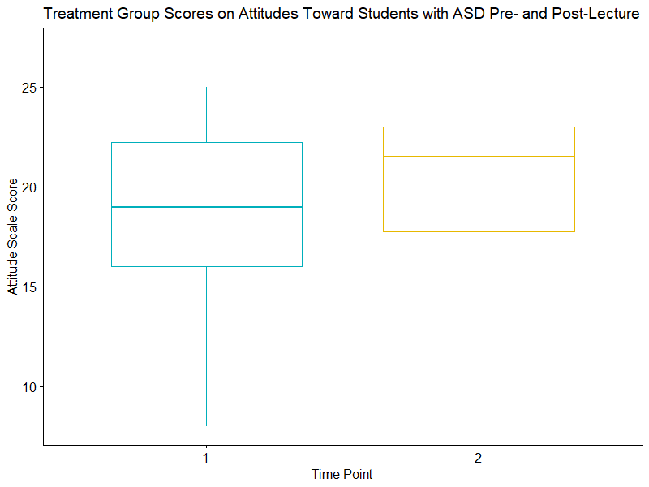

# Attitudes Toward Autistic College Students Pre- and Post-Intervention Analyses
## Factorial ANOVA, One-Way ANOVA, Wilcoxon Signed-Rank Test, and Wilcoxon Rank-Sum Test in R

### Project Background
I worked with a professor to see if they could improve Intro to Psychology students' attitudes toward and knowledge about Autistic students by presenting a lecture about Autism in their class. They gave students a survey pre- and post-lecture to assess attitudes and knowledge. Other professors teaching Intro to Psychology courses at the same institution during the same semester give their students the same survey, without having the lecture, to serve as a control group.

### Analyses
I ran One-Way Within-Subjects ANOVAs, One-Way Between-Subjects ANOVAs, Factorial ANOVAs, Wilcoxon Rank-Sum Tests and Wilcoxon Signed-Rank Tests.

ANOVAs were run first, and results were not statistically significant. This was likely due to small sample sizes and non-normal distributions of scores on the attitudes and knowledge scales. Thus, non-parametric tests (Wilcoxon Rank-Sum Tests and Wilcoxon Signed-Rank Tests) were used.

Wilcoxon Signed-Rank Test Example Code:

~~~R
#test comparing total scores on attitude scale for treatment group at baseline and follow-up
wilcox.test(tx_2$a_tot, tx_2$a_tot_2, paired=TRUE)

#calculate effect size, Cliff's delta, for difference between baseline and follow-up in tx group, attitude scale 
cliff.delta(tx_2$a_tot, tx_2$a_tot_2, conf.level=.95, 
            use.unbiased=TRUE, use.normal=FALSE, 
            return.dm=FALSE)

~~~

### Results
Students in the treatment group had more favorable attitudes toward Autistic students and more knowledge about Autistic people after participating in the lecture. Results of the Wilcoxon Signed-Rank Tests showed statistically significant differences in the ranks between pre- and post-lecture attitudes and knowledge scores among students in the treatment group.

Code to create the above boxplot:

~~~R
#create boxplot for treatment group
ggboxplot(tx, x = "observation", y = "a_tot", 
          color = "observation", palette = c("#00AFBB", "#E7B800"),
          order = c("1", "2"),
          title = "Treatment Group Scores on Attitudes Toward Autistic Students Pre- and Post-Lecture",
          ylab = "Attitude Scale Score", xlab = "Time Point",
          legend = '')
~~~

### A Note
This README has been updated to use the term "Autistic students" rather than "students with ASD," as many people in the Autism community use identity-first language. You can read more about why this is important [here](https://autisticadvocacy.org/about-asan/identity-first-language/). Updated on December 1, 2020.
